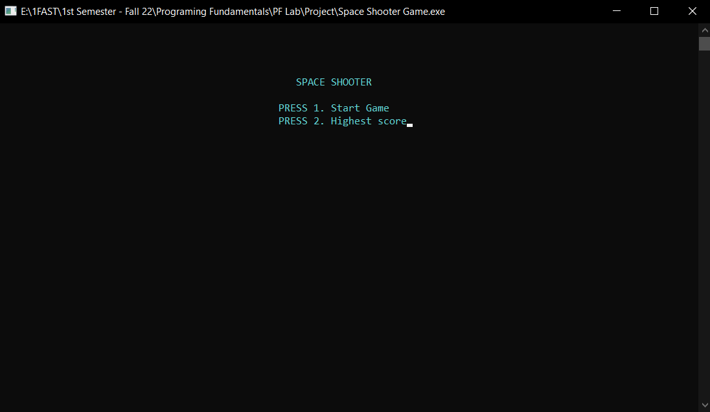
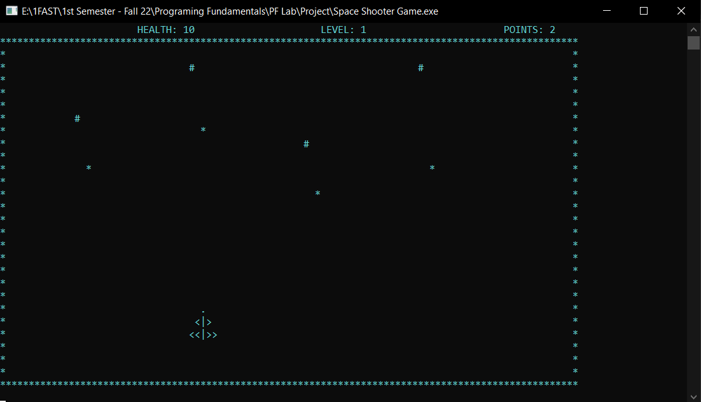
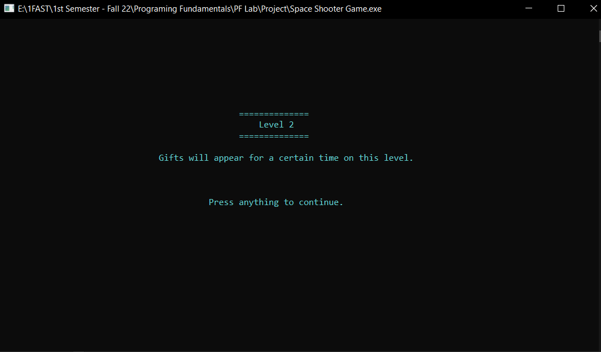
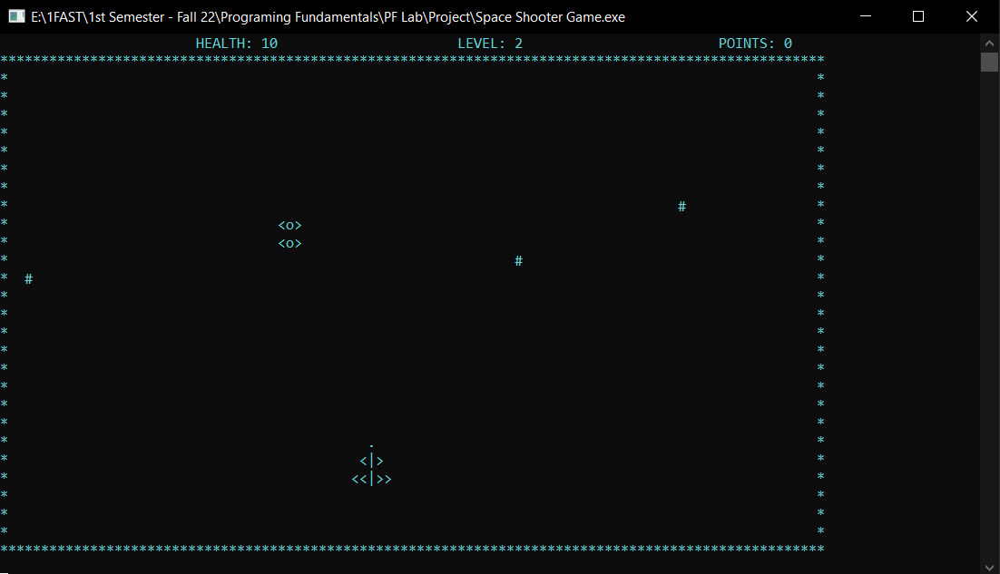

# 🚀 Space Shooter Game (C++)

## 📌 Project Overview

A console-based **Space Shooter Game** developed in C++ for Programming Fundamentals.
The game features real-time input, enemy waves, scoring, and level progression.

---

## 👨‍💻 Team Members

* Abdul Rahman
* Muhammad Umer
* Ahsan Butt

---

## 🎮 Features

* 🚀 Player-controlled spaceship
* 👾 Enemy waves with different formations
* 🔫 Bullet shooting system
* ❤️ Health system with damage handling
* 🎁 Gifts (health boosts in Level 2)
* ⭐ Animated star background
* 📊 Score tracking with file handling
* 🏆 High score system

---

## 🕹️ Controls

| Key   | Action     |
| ----- | ---------- |
| ↑     | Move Up    |
| ↓     | Move Down  |
| ←     | Move Left  |
| →     | Move Right |
| Space | Fire       |
| ESC   | Exit       |

---

## 🎯 Game Levels

* **Level 1** → Destroy 10 enemies to unlock Level 2
* **Level 2** → Faster enemies + health gifts
* Destroy 12 enemies to **WIN the game**

---

## 📸 Game Screenshots

### 🏠 Home Screen

---

### 🎮 Level 1 Gameplay

---

### ⚔️ Advanced Gameplay

---

### 🚀 Level 2 Action

---

### 🏆 Score Board

---

## ⚙️ How to Run

1. Open project in any C++ compiler (CodeBlocks / Dev C++ / Visual Studio)
2. Compile the `main.cpp` file
3. Run the program

---

## 💾 Files Included

* `main.cpp` → Game source code
* `score.txt` → High score storage
* `screenshots/` → Game images
* `README.md` → Project documentation

---

## 🛠️ Technologies Used

* C++ (Programming Fundamentals)
* Windows Console API (`windows.h`)
* File Handling (`fstream`)

---

## 📌 Notes

* Designed for **Windows console**
* Uses `_kbhit()` and `Sleep()` for real-time gameplay
* Works best in full-screen terminal

---

## ⭐ Future Improvements

* Sound effects 🔊
* Boss fights 👾
* Better graphics 🎨
* Multiplayer mode 🎮

---

## 🏁 Conclusion

This project demonstrates core programming fundamentals including:

* Arrays
* Loops
* Functions
* File handling
* Game logic design

---

## 📜 License

This project is for academic use only.
